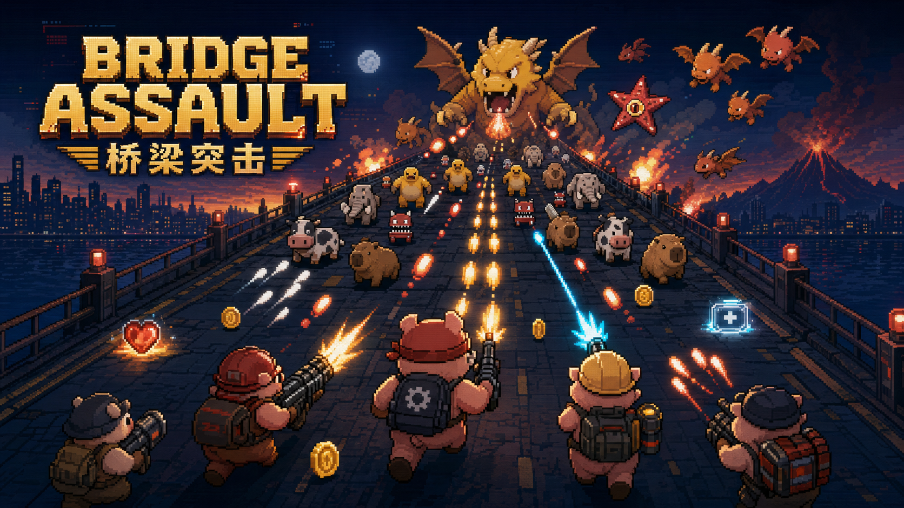
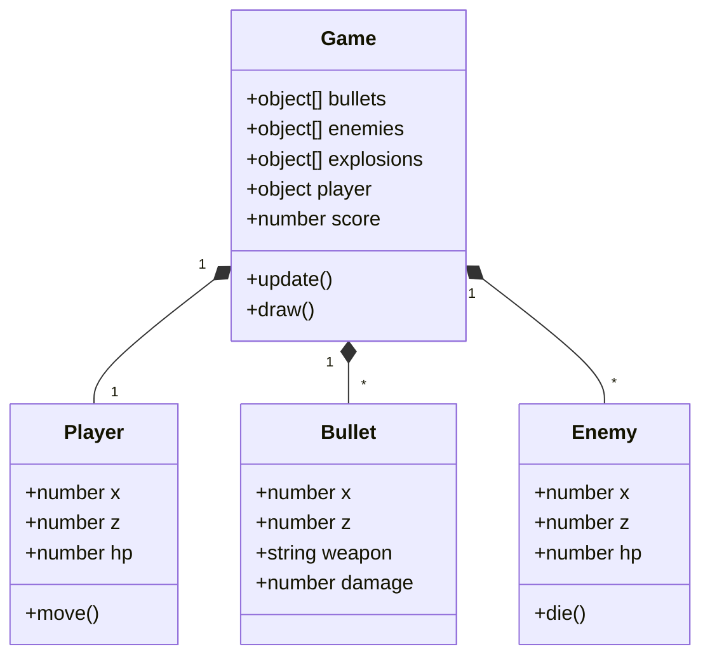
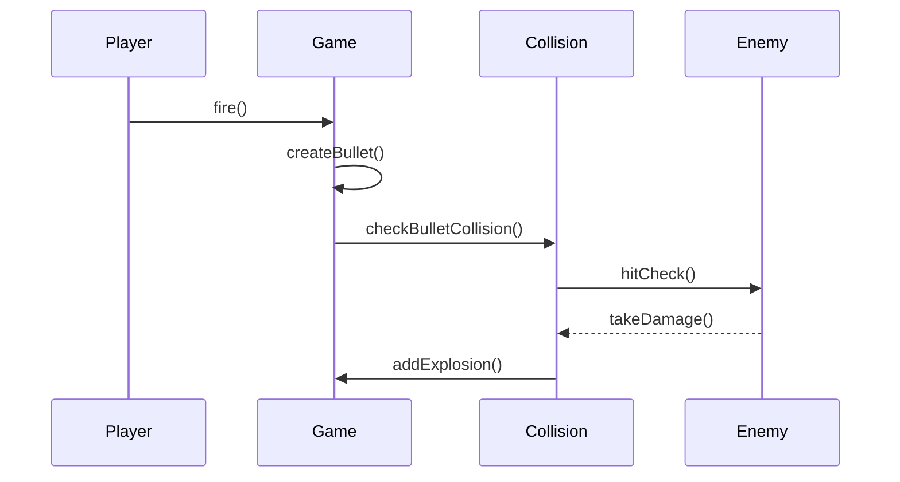

# 2026-group-25
2026 COMSM0166 group 25

## Bridge Assault

**Bridge Assault** is a bilingual pixel-art arcade survival shooter about lane control, risk-reward upgrades, boss waves, and long-term progression. The game is an on-rails arcade survival shooter built with p5.js. The player moves left and right across an auto-scrolling battlefield while firing automatically at waves of enemies. Survival depends on positioning, reading enemy patterns, choosing useful buff/debuff gates, collecting coins and gems, and upgrading weapons between runs.

The game currently includes two playable stages:

- **Level I: Bridge Assault** - the main battlefield, ending at wave 66.
- **Level II: Doomsday Factory** - a harder second stage with additional enemy types and a final wave at wave 88.

This final version also includes permanent progression, a shop, special weapons, talents, achievements, bilingual English/Chinese UI, and an online leaderboard.
 
 

🎮 **[Play the game here!](https://uob-comsm0166.github.io/2026-group-25/)**

 
 

## Privacy

We reviewed data collection in this game and documented what is collected, why, and how it is handled.

- See [`PRIVACY.md`](./PRIVACY.md) for full details.
- Core gameplay works without submitting remote personal data.
- Leaderboard visibility is privacy-first (private by default unless player explicitly enables public visibility).

https://github.com/user-attachments/assets/66b7e2b0-84a3-4597-a25d-86f141d7d775

## Your Group

- Lichong YAO, zi25826@bristol.ac.uk, Designer
- Yusheng Yang, vj25954@bristol.ac.uk, Manager
- Zhiqin Lin, pu25346@bristol.ac.uk, Coder
- Yulun Wu,sq25375@bristol.ac.uk, Testing engineer
- Yiyang Dong, hh25303@bristol.ac.uk, Coder

## Project Report

### 1. Introduction

Bridge Assault is a pixel-art, on-rails survival shooter inspired by the immediate arcade action of classic side-scrolling shooters and the long-term build progression of modern survival games. The player advances automatically through a dangerous battlefield and can only move left and right. Shooting is automatic, which keeps the controls simple but shifts the challenge toward positioning, dodging, lane choice, and upgrade decisions.

The main twist is the combination of constrained movement with layered progression. During a run, players pass through buff/debuff gates that can increase or reduce their troop count, change their weapon, or create short-term tactical advantages. Between and during runs, players collect coins and gems that can be spent on stronger pistol tiers, special weapons, defensive items, and permanent talents. This gives the game both short-term decision-making and long-term goals.

The game also expands beyond a single stage. Level I, Bridge Assault, introduces the core systems through escalating waves and dragon boss fights. Level II, Doomsday Factory, adds harder enemy types, stronger bosses, and a longer wave structure. The result is a compact arcade game with a clear "one more run" loop: each attempt helps the player learn enemy patterns, earn resources, unlock upgrades, and push further into the next stage.

The final version also includes bilingual English/Chinese text, achievements, persistent local progress, and an online leaderboard, making the game feel closer to a complete playable product rather than a short prototype.

---

### 2. Requirements 

#### 2.1&nbsp;&nbsp;Early Stage Design & Ideation  

During the ideation phase, the team conducted a comparative review of multiple genres before selecting a final direction. The objective was to identify a concept that simultaneously offered (i) a clear and testable core loop, (ii) sufficient strategic depth for replayability, and (iii) feasible implementation within module constraints. The references below were analysed using these criteria.

| Reference | Core loop analysed | Design takeaway | Decision |
|---|---|---|---|
| Precision platformers | Movement, hazards, repeated attempts | Strong challenge comes from readable rules and precise feedback | Not chosen because level design would require too much content and tuning |
| Turn-based risk games | Risk, uncertainty, reward calculation | Tension can come from uncertain but meaningful choices | Used as inspiration for buff/debuff gates |
| Vampire Survivors-style survival games | Auto-attack, waves, build choices, meta-progression | Simple controls can still support deep progression | Chosen as a major influence |
| Classic arcade shooters | Dodging, enemy waves, power fantasy | Immediate feedback and readable enemy attacks are important | Chosen as a major influence |
| Final concept | Auto-scroll, left/right movement, auto-fire, gates, shop progression | Accessible controls plus meaningful build decisions | Selected |

The analysis indicated that a survival-shooter framework provided the strongest balance between gameplay depth and delivery feasibility. Consequently, we selected a design primarily informed by Vampire Survivors, while introducing a deliberate control constraint to differentiate the project: the player advances on an on-rails battlefield and can move only along the horizontal axis while firing upward automatically. This constraint preserves accessibility while increasing tactical load through lane selection, threat anticipation, and positioning discipline.

The final concept is further differentiated by a two-layer progression model. At run-time, players alter weapon behaviour through upgrades (fire rate, bullet count, and bullet types such as spread, fire, and piercing). Across runs, coin-based meta-progression supports persistent upgrades and unlocks. In addition, fixed-wave shop milestones create predictable strategic checkpoints, formalising the trade-off between immediate spending and long-term saving.

---

#### 2.2&nbsp;&nbsp;Paper Prototype

| **Idea 1 (The version ultimately adopted)** | **Idea 2 (One of the dismissed case)** |
|:--:|:--:|
|  |  |

The final paper prototype consolidated the adopted concept into a single, testable gameplay blueprint: an on-rails survival shooter in which player agency is intentionally constrained to horizontal movement while upward firing is automated. This prototype specified the intended experiential core—continuous lane-based evasion under escalating enemy pressure—together with two linked progression layers: short-term in-run modification of weapon behaviour (e.g., fire rate, bullet count, and bullet type), and long-term coin-driven meta progression through persistent upgrades and unlocks. In addition, fixed-wave shop milestones were formalised as strategic decision checkpoints to regulate pacing and support comparative playtesting. As a design artefact, the prototype functioned not only as a visual concept but also as an implementation contract, enabling the team to align system boundaries, prioritise feature scope, and maintain consistency between early ideation and the currently developed game build.

---

#### 2.3&nbsp;&nbsp;Stakeholders & Onion Model  

We identified stakeholders using an onion model approach:  

Core (Players): casual arcade players who want instant action and short runs; progression-focused players who enjoy long-term unlocks and build crafting.  

Secondary (Testers/Assessors): need clear UI feedback, consistent difficulty ramp, and evidence of design decisions.  

Outer (Developers/Maintainers): our team, who require modular systems (state machine, data-driven configs) for fast iteration and balancing.  

  

---

#### 2.4&nbsp;&nbsp;Use Case Diagram  

The primary actor is the player. The player can start a run, choose a level, move left and right, survive waves, collect coins and gems, use weapons or special skills, purchase upgrades, claim achievements, submit leaderboard scores, and restart after game over.

A secondary actor is the tester or assessor. They need to verify repeatable flows such as starting a run, pausing, buying upgrades, switching languages, claiming achievements, testing game-over behaviour, and checking that progress persists after reloading the page.

  

---

#### 2.5&nbsp;&nbsp;User Stories  

| Epic | User story | Acceptance criteria |
|---|---|---|
| Start and restart loop | As a new player, I want to start a run quickly so I can learn the game without setup. | Start button enters gameplay; run state resets correctly; persistent upgrades remain. |
| Movement and combat | As an arcade player, I want simple left/right movement and automatic shooting so I can focus on dodging and positioning. | Player remains inside road bounds; movement is responsive; shooting continues automatically during gameplay. |
| Pause and resume | As a tester, I want pause and resume to freeze gameplay reliably so I can check state transitions without unfair damage. | Enemies, bullets, timers, and waves do not advance during pause. |
| Upgrade gates | As a strategy-focused player, I want gates to present clear risk-reward choices so each run feels different. | Gate effects are readable before contact and immediately visible after selection. |
| Shop and progression | As a returning player, I want coins and gems to persist so my previous runs contribute to long-term progress. | Purchases save correctly and remain after page reload. |
| Level unlocks | As a progression-focused player, I want Level II to unlock after completing Level I so I have a clear long-term goal. | Level II is locked before the condition and stays unlocked afterwards. |
| Achievements | As a completionist player, I want achievements with claimable rewards so I have optional goals beyond survival. | Achievement progress updates, claim buttons appear, and rewards update the balance. |
| Leaderboard | As a competitive player, I want to submit my best score so I can compare performance with others. | Best score syncs online when available and local progress remains if sync fails. |
| Bilingual UI | As a bilingual player, I want to switch between English and Chinese so I can use the interface comfortably. | Menu, shop, achievements, leaderboard, and game-over text update consistently. |
| Maintainability | As a developer, I want gameplay values stored in config files so balancing can be adjusted without rewriting core logic. | Weapons, levels, talents, and enemy settings are defined in configuration objects. |
| Assessment | As an assessor, I want the README to match the implemented game so I can evaluate design, implementation, and testing evidence clearly. | Report sections describe current features, real modules, and actual evaluation results. |
  

---

#### 2.6 Reflection on Requirements Engineering

Through this project, we learned that Epics and User Stories are vital for managing feature creep. By breaking down high-level goals into granular stories, we could isolate complex mechanics, such as the "Start and restart loop" or "Shop and progression" systems. Defining clear Acceptance Criteria for every user story listed in section 2.5 was crucial for testing; for example, defining the "Leaderboard" acceptance criteria as "Best score syncs online when available" prevented us from blocking gameplay when the server was unreachable. This structured approach forced us to align our technical implementation—such as modular JavaScript architecture—directly with player-facing needs, ensuring that our final product remained cohesive despite its complex multi-layer progression.

### 3. Design

We designed the game around a **state-driven architecture** with small, testable systems. This keeps the codebase maintainable in p5.js and makes it easier to add content (new enemies, new bullet types, new upgrades) without rewriting core logic.  

#### 3.1 Overall Architecture

The game is built as a browser-based p5.js application. The code is organised into small JavaScript modules under the `docs/js` folder. This structure allowed us to separate gameplay data, frame updates, UI rendering, persistence, shops, achievements, and leaderboard logic.

At a high level, the game runs through several states:

- **Menu** - player can start, open the shop, view achievements, or open the leaderboard.
- **Level select** - player chooses between Level I and Level II.
- **Playing** - core gameplay loop, including movement, shooting, waves, enemies, pickups, and gates.
- **Paused** - gameplay is temporarily stopped.
- **Mid-shop** - a shop state shown during a run after certain boss encounters.
- **Revive** - player can revive under specific conditions.
- **Game over** - results are shown and progress can be saved.
- **Leaderboard / Achievements / Shop overlays** - menu-level UI states.

---

#### 3.2 Module Structure  

| File | Responsibility |
|---|---|
| `docs/index.html` | Main HTML structure, overlays, menu panels, and script loading |
| `docs/style.css` | Game UI, menus, shop panels, achievements, leaderboard, and responsive styling |
| `docs/js/main.js` | p5.js lifecycle, setup, draw loop, and high-level game state routing |
| `docs/js/config.js` | Game constants, level settings, weapons, talents, enemy types, and balance data |
| `docs/js/input.js` | Keyboard, mouse, and touch input handling |
| `docs/js/update.js` | Main update flow for each frame |
| `docs/js/update_world.js` | Gates, wave spawning, barrels, coins, gems, and world progression |
| `docs/js/update_effects.js` | Visual effects, timers, and feedback effects |
| `docs/js/shop.js` | Permanent shop, weapon purchases, talents, and item UI |
| `docs/js/achievements.js` | Achievement definitions, tracking, claiming, and notifications |
| `docs/js/leaderboard.js` | PocketBase leaderboard connection and score synchronisation |
| `docs/js/i18n.js` | English/Chinese translation dictionary and language switching |
| `docs/js/storage.js` / related helpers | Local progress persistence and player data management |

---

#### 3.3 Gameplay Loop  

The core loop is:

1. Start or continue from the main menu.
2. Choose an available level.
3. Move left and right while the battlefield scrolls forward.
4. Avoid bullets and enemies while automatic fire attacks targets.
5. Choose gates to gain or risk squad strength and temporary weapons.
6. Defeat boss waves to earn coins, gems, and experience.
7. Spend resources on upgrades, talents, and special tools.
8. Push further into the level or restart with stronger progression.

This loop was designed so that even short runs still feel useful. A player who dies early can still earn currency or achievement progress, while experienced players can aim for level completion and leaderboard scores.

---

#### 3.4 Design Rationale  

We kept the control model intentionally small. If the player also had to aim, shoot, jump, or manage many buttons, the game would become harder to learn and harder to test. By using automatic shooting and left/right movement, we could put more design effort into enemy pressure, upgrade choices, progression, and feedback.

We also separated short-term and long-term decisions. Gates and weapon pickups affect the current run immediately, while shop upgrades and talents change future runs. This gives the game a layered structure: quick arcade action in the moment, and gradual improvement over time.

#### 3.5 UML Diagrams

**Class Diagram**

**Sequence Diagram (Shooting & Collision)**

---

### 4. Implementation

#### 4.1 Technical Challenge 1: Managing Many Game States

A major implementation challenge was controlling which systems update during each game state. The game contains several states: menu, level select, playing, paused, mid-shop, revive, game over, achievements, shop, and leaderboard. If gameplay logic continues during the wrong state, the player can be damaged unfairly or timers can move while the screen is paused.

To address this, the update flow checks the current state before advancing gameplay systems. Combat, spawning, pickups, wave progression, and enemy movement belong to the active playing state. UI states such as shop, achievements, and leaderboard are handled separately through overlays and DOM elements.

This was especially important for pause and mid-shop behaviour. These screens must feel safe to open, because the player should not lose troops while reading options or checking rewards.  

---

#### 4.2 Technical Challenge 2: Persistent Progression and Economy

The game contains several connected progression systems: coins, gems, pistol tiers, special weapons, talents, achievements, unlocked levels, and leaderboard identity. These systems must remain consistent between gameplay, shop UI, game-over results, and browser reloads.

We used local browser storage for persistent player data. When a player collects coins or gems, buys an item, claims an achievement, or unlocks a level, the data is updated and saved. The shop reads this data to decide which items are locked, affordable, purchased, or equipped.

One implementation challenge was keeping the UI synchronized with the saved data. For example, after claiming an achievement reward, the coin/gem balance must update immediately. After buying a weapon or talent, the shop must refresh its button states and prices. This required careful UI refresh logic rather than only updating hidden data values.

---

#### 4.3 Technical Challenge 3: Waves, Bosses, and Level Progression

The wave system controls enemy pressure, boss encounters, and level completion. Level I ends at wave 66 and Level II ends at wave 88. Bosses appear at fixed milestones, and the final waves use double-boss encounters to create a clear climax.

The difficulty was making wave progression predictable while still exciting. If enemies spawn too aggressively, the player cannot read the screen. If bosses or rewards trigger in the wrong order, level completion can fail or rewards can be duplicated. The implementation therefore separates wave spawning, boss spawning, reward drops, and level-completion checks.

Level II also required new enemy behaviours and balance values. This made configuration important, because enemy speed, score value, sprite data, and boss rules need to be adjusted without rewriting the whole update loop.

---

#### 4.4 Additional Implemented Features

The final version includes:

- English/Chinese language switching.
- Persistent shop and talent progression.
- Multiple pistol tiers and special weapons.
- Achievement categories with claimable rewards.
- Online leaderboard support.
- Level unlock logic.
- Mid-run shop rewards after major encounters.
- Audio and visual feedback for pickups, gates, waves, and combat.

---

### 5. Evaluation

#### 5.1 Qualitative Evaluation

We evaluated the game through informal playtesting and team review. Testers were asked to start from the main menu, enter gameplay, survive several waves, interact with gates, open the shop, check achievements, and comment on what felt clear or confusing.

| Area tested | Feedback received | Change or response |
|---|---|---|
| Controls | Players understood left/right movement quickly. | Kept movement simple and focused on dodging. |
| Gates | Gate choices were interesting, but feedback needed to be more visible. | Added stronger text and visual effects after gate selection. |
| Shop | Players wanted clearer separation between upgrade types. | Organised the shop into weapon, special, and talent areas. |
| Achievements | Claimable rewards were useful but needed a clearer claim action. | Improved achievement panel layout and claim button visibility. |
| Language | Mixed Chinese/English text made the interface inconsistent. | Added a central bilingual text system and language toggle. |
| Progression | Players liked earning resources even after losing. | Kept coins, gems, and achievement progress persistent. |

---

#### 5.2 Quantitative Evaluation

We used simple measurable checks to evaluate whether the game was playable, repeatable, and not only subjectively fun.

| Metric | Why it matters | Result |
|---|---|---|
| First-run survival wave | Checks whether the early game is too hard | TBC after final playtest |
| Level I completion rate | Checks whether progression and boss difficulty are balanced | TBC after final playtest |
| Average coins per early run | Checks whether shop progression is too slow or too fast | TBC after final playtest |
| Achievement reward success | Checks whether claimable rewards update correctly | Pass in manual testing |
| Language switch coverage | Checks whether bilingual UI is consistent | Pass for main menu, shop, achievements, leaderboard, and game-over UI |
| Leaderboard failure behaviour | Checks whether online features break core play | Core game remains playable when leaderboard access fails |

The quantitative results still need final playtest numbers for difficulty and economy balance. However, feature reliability was tested manually through repeated UI and gameplay flows.

---

#### 5.3 Code Testing

Testing focused on the areas most likely to produce bugs: state transitions, persistent data, shop purchases, achievement rewards, leaderboard behaviour, and final wave logic.

| Test area | Example test |
|---|---|
| Menu flow | Start game, choose level, return to menu, restart |
| Pause | Pause during gameplay, wait, resume, check that gameplay continues correctly |
| Shop | Buy item, verify cost deduction, reload page, confirm purchase persists |
| Talents | Buy talent levels and confirm balance and level indicators update |
| Achievements | Trigger progress, claim reward, confirm coins/gems update |
| Leaderboard | Join leaderboard, submit score, hide/show own score |
| Language | Switch language across multiple UI panels |
| Final waves | Check Level I wave 66 and Level II wave 88 behaviour |
| Save data | Reload browser and confirm coins, gems, unlocks, and achievements remain |

We also used branch-based development and pull requests so that larger changes could be reviewed before reaching the main branch.

---

### 6. Process

At the beginning of the project, our teamwork was more informal than planned. We discussed ideas as a group and divided responsibilities by role, but we did not initially use GitHub as the main place for day-to-day development. Some early work was shared through direct file exchange and local changes, which felt faster at first but gradually created problems as the project became larger.

The main issue was that different parts of the game started to depend on each other. Gameplay, UI, shop progression, achievements, language switching, and leaderboard features were no longer isolated. When work was not tracked through GitHub branches, it became harder to know which version was the newest, which changes had already been integrated, and whether one person's local changes might accidentally overwrite another person's work. This also made debugging more difficult because bugs could come from integration problems rather than from a single feature.After recognising these problems, we changed our workflow. We began using GitHub more deliberately for version control, issue tracking, branches, and pull requests. Instead of treating `main` as a place for direct changes, we started using separate branches for larger fixes and features. This allowed the team to discuss changes before merging them and reduced the risk of breaking the playable version. It also gave us a clearer history of what had changed and why.This transition was not immediate. We had to learn how to use branches, commits, pull requests, and issue references more carefully while the game was already in active development. There were also practical difficulties, such as setting up GitHub permissions, understanding when to push a branch rather than update `main`, and making sure documentation matched the implemented game. However, working through these problems improved the project. The team became more confident using GitHub as a shared workspace rather than just a place to store the final code.Our roles also became clearer over time. The designer focused on game feel, visual direction, and user experience. The coders worked on gameplay systems, UI, shop progression, achievements, and leaderboard features. The testing engineer focused on checking state transitions, save data, progression, and edge cases. The manager helped coordinate tasks and keep the group aligned as the project scope changed.One important lesson from the process was that collaboration tools are part of software engineering, not just administration. Early informal work helped us move quickly, but it did not scale well once the game became more complex. Moving toward a branch-and-pull-request workflow made the project more stable and made team communication clearer.

Another challenge was that implementation moved faster than documentation. Features such as bilingual UI, achievements, leaderboard support, and Level II were added after earlier report sections had already been drafted. This meant the README no longer fully represented the real game. We adapted by reviewing the current implementation, comparing it against the project template, and updating the report so that it described the actual final product rather than only the early idea.

Overall, our process improved significantly during the project. We began with informal coordination, encountered real integration and version-control problems, and then adapted by adopting a more structured GitHub workflow. This made the final stages of development more reliable and gave us a clearer understanding of how professional team software development works.

---

### 7. Sustainability

We considered sustainability using the Sustainability Awareness Framework introduced in the module. This helped us look beyond the direct environmental footprint of the code and consider longer-term effects across environmental, technical, social, individual, and economic dimensions. For this report, we focus mainly on environmental impact, technical sustainability, and social/individual impact, while also recognising some economic trade-offs.

Environmentally, Bridge Assault is a relatively lightweight browser game. It is deployed as a static GitHub Pages site rather than as a large installed application or server-heavy online game. The playable `docs` folder is about 7.2 MB in total, with around 0.38 MB of JavaScript. Most of the size comes from image and audio assets, including 10 PNG files and 12 MP3 files. This is small compared with many commercial games, but it is still not impact-free: every page load transfers data, uses network infrastructure, and consumes energy on the player's device.The game uses p5.js and 2D rendering rather than a heavy 3D engine. This keeps hardware requirements low and allows the game to run on ordinary laptops through a browser. This is relevant to ICT's own footprint and obsolescence: software that requires newer hardware can indirectly contribute to waste, while lightweight browser software can extend the usefulness of existing devices. Because the game is accessed through a link, players do not need to install extra software or repeatedly download large updates.Runtime efficiency was also considered. Bridge Assault contains many moving objects, including bullets, enemies, bosses, pickups, gates, particles, and UI effects. If these objects accumulate or update unnecessarily, the game wastes CPU resources. To reduce this, temporary visual effects have lifetimes, collected pickups are removed, and gameplay updates are tied to active game states. Menus, pause screens, shops, achievements, and leaderboard overlays should not keep all gameplay systems running as if the player were still actively playing. This supports the idea that sustainability should be considered during implementation and testing, not only during deployment.

There are still environmental risks. Some assets are relatively large, especially character sprite sheets and the two background music tracks. If development continued, one useful Green Software improvement would be asset optimisation: compressing PNGs and MP3s, removing unused files, and checking whether all sound effects are necessary. This would reduce network transfer, loading time, and device work. Another relevant improvement is minimising unnecessary computation by ensuring inactive states do not update gameplay systems. Future testing could also include measuring page load size and checking CPU usage during long play sessions.Technical sustainability is important because a game that is hard to maintain becomes difficult to improve, test, or repair. We addressed this by separating the project into modules such as configuration, input, update logic, world progression, shop, achievements, leaderboard, and language switching. Future developers can change weapon costs, enemy values, level data, or translation strings without rewriting the whole game loop. This supports maintainability, usability, and long-term evolution. It also reduces the chance that small changes create unexpected bugs across unrelated systems.

The leaderboard creates a sustainability trade-off. It improves social and competitive value because players can compare scores, but it also depends on a remote PocketBase service. This adds network requests, backend storage, privacy considerations, and possible failure states. To reduce this impact, the core game does not depend on constant server communication. Local progress is stored in the browser, and the leaderboard is only used for score-related features. If the leaderboard service fails, the main game should remain playable.From a social and individual perspective, Bridge Assault aims to be accessible through simple controls and bilingual English/Chinese UI. The limited control scheme makes the game easier for new players to learn, while language switching supports a wider group of users in our team and player base. However, the game also uses flashing effects, fast bullets, and intense visual feedback. Future work should include clearer accessibility options such as reduced effects, stronger tutorials, reliable pause behaviour, and explicit privacy messaging before leaderboard submission.

If Bridge Assault reached a much larger audience, the main sustainability impacts would scale through repeated asset downloads, leaderboard storage, privacy responsibility, and long-term maintenance. Overall, the game has a modest footprint because it is a small static browser game with low hardware requirements. The main future improvements are asset compression, reduced unnecessary runtime updates, better accessibility settings, clearer leaderboard privacy information, and sustainability checks added to the development backlog.

---

### 8. AI Statement

Our team used AI tools during the project as development support, especially for asset creation, code migration, debugging, and documentation. AI was not used to replace team decision-making, but it helped us work through technical problems more efficiently.

For visual materials, we used AI-assisted workflows connected with tools such as Photoshop to help produce or adapt some game art assets. These assets were then selected, adjusted, and integrated by the team so that they matched the pixel-art arcade style of Bridge Assault. AI support was useful for quickly exploring visual directions, but final asset choices and how they appeared in the game were made by the team.AI was also important during early implementation. Our first incomplete version was not originally built with p5.js, so AI was used to help convert and restructure that early prototype into a p5.js-based browser game for the first submitted version. The team then reviewed, tested, and modified the generated or suggested code to fit our actual game mechanics, including the scrolling battlefield, automatic shooting, gates, enemies, and UI states.Later in development, AI was used to help debug JavaScript issues, review possible edge cases, create GitHub issue descriptions, and improve README/report writing. For example, AI helped us reason about pause behaviour, save data, leaderboard failures, final wave logic, and how to structure the report according to the project template. Also, GitHub Copilot review were used to review some pull requests and identify issues such as mismatched documentation, duplicated logic, and possible performance problems.

All AI-assisted output was checked by team members before being included. The game concept, final design choices, testing, integration, and submitted project remain the responsibility of the team.

---

### 9. Conclusion

Bridge Assault developed from a simple auto-shooting idea into a more complete browser game with two levels, boss waves, upgrade gates, shop progression, achievements, bilingual UI, persistent save data, and leaderboard support. The final game is much larger than our first prototype, and this helped us understand how quickly a small game can become a complex software project once many systems need to interact.

One of the main technical lessons was the importance of state management. At first, it was easy to think of menus, pause screens, shops, achievements, and leaderboard panels as separate UI features. However, in a real-time game they directly affect gameplay logic. If the wrong systems continue updating during pause or shop states, the player experience becomes unfair. This made us more aware of the need to design game states carefully and test transitions between them.

We also learned that persistent progression adds complexity beyond simple gameplay. Coins, gems, weapons, talents, achievements, level unlocks, and leaderboard records all depend on player data. A change in one area can affect several others. This encouraged us to think more carefully about saving, loading, UI refresh behaviour, and edge cases such as reloading the page or claiming rewards.From a teamwork perspective, the project taught us that collaboration methods matter as much as individual coding ability. Early in development, we did not use GitHub as effectively as we should have, and this caused difficulties when combining work. After recognising this, we moved toward a more structured workflow using branches, pull requests, and issue tracking. This was not always easy, but it made the project more stable and helped us understand why version control is central to software engineering.

The project also showed us the importance of keeping documentation up to date. Our README initially described the early concept more than the current game. As features were added, the gap between the report and the implementation became larger. Updating the documentation forced us to review what had actually been built, explain our design decisions more clearly, and connect the final product back to the original requirements.If we had more time, our immediate next steps would be to add a clearer tutorial, collect more playtest data, balance Level II more carefully, improve mobile support or clearly define the game as desktop-only, and make leaderboard privacy and network-failure behaviour clearer. We would also continue polishing boss phases, enemy variety, and weapon build identities.For a larger sequel or extended version, we would like to add more stages, stronger narrative themes, more specialised enemy roles, challenge modes, deeper weapon combinations, and more detailed progression paths. We would also start with a stronger GitHub workflow from the beginning, so that design, implementation, testing, and documentation could evolve together instead of being repaired near the end.

Overall, Bridge Assault helped us practise both game development and software engineering. We improved our understanding of p5.js, real-time interaction, modular JavaScript, testing, GitHub collaboration, and project documentation. The final result is not perfect, but it represents a meaningful step from an early idea to a playable and maintainable game.

### 10. Contribution Statement

| Member | Role | Main contribution areas | Approx. contribution |
|---|---|---|---|
| Lichong YAO | Designer | Game concept, visual direction, UI feedback, player experience, documentation support | 20% |
| Yusheng Yang | Manager | Team coordination, planning, task tracking, repository organisation, report structure | 20% |
| Zhiqin Lin | Coder,Reviewer | Core gameplay, combat systems, enemy waves, weapons, boss behaviour, code review, UI/UX implementation, achivement, shop/progression systems, leaderboard support| 20% |
| Yulun Wu | Testing engineer | Manual testing, bug reporting, edge-case checks, playtest feedback, QA notes | 20% |
| Yiyang Dong | Coder | UI implementation, shop/progression systems, leaderboard support | 20% |

