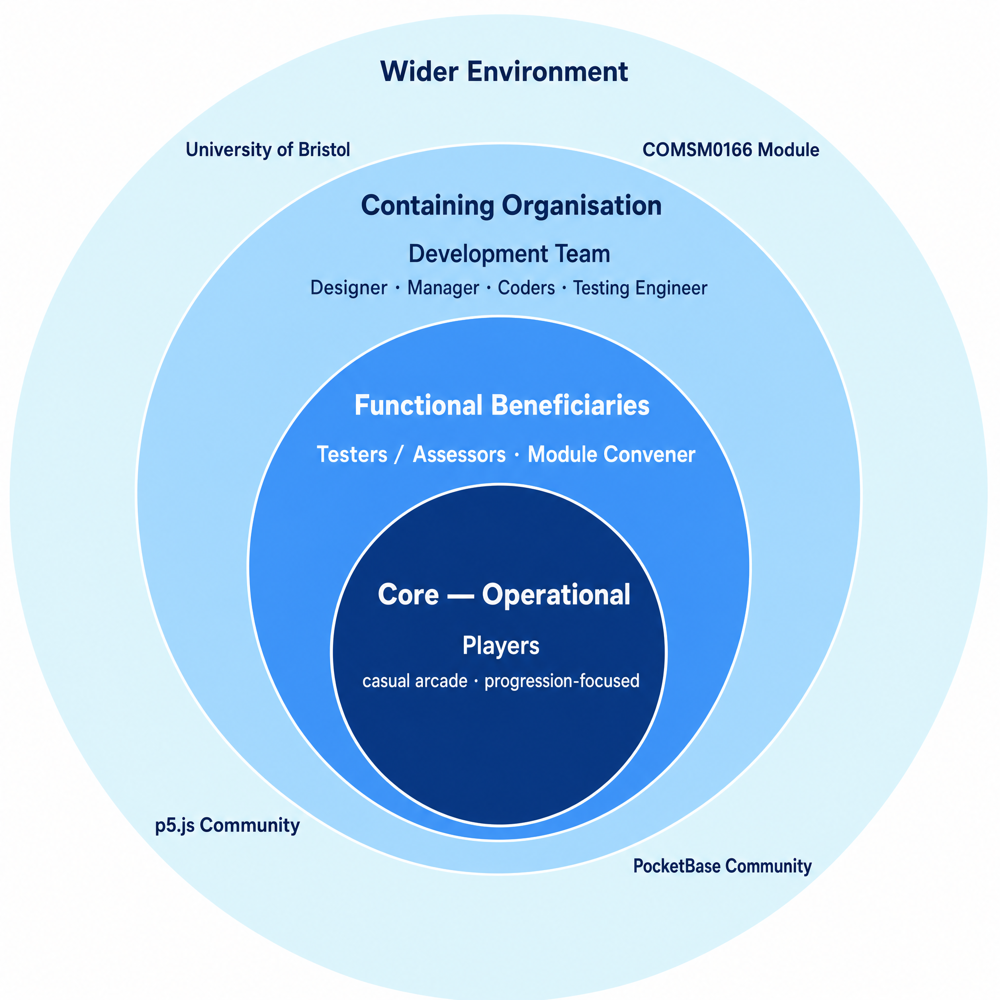
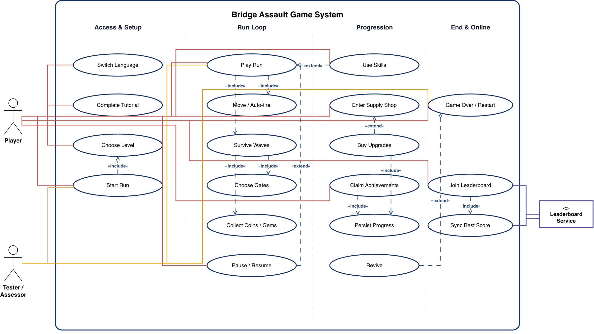
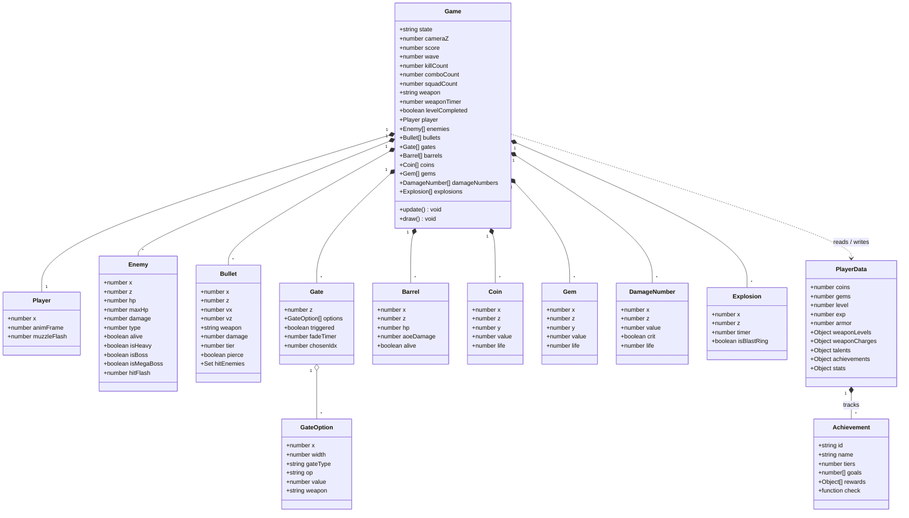
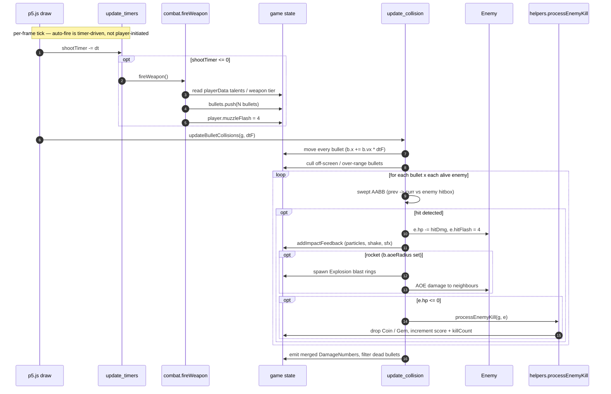

# 2026-group-25
2026 COMSM0166 group 25

<div align="center">

</div>

## Bridge Assault


**Bridge Assault** is a bilingual pixel-art arcade survival shooter about lane control, risk-reward upgrades, boss waves, and long-term progression. The game is an on-rails arcade survival shooter built with p5.js. The player moves left and right across an auto-scrolling battlefield while firing automatically at waves of enemies. Survival depends on positioning, reading enemy patterns, choosing useful buff/debuff gates, collecting coins and gems, and upgrading weapons between runs.

The game currently includes two playable stages:

- **Level I: Bridge Assault** - the main battlefield, ending at wave 66.
- **Level II: Doomsday Factory** - a harder second stage with additional enemy types and a final wave at wave 88.

This final version also includes permanent progression, a shop, special weapons, talents, achievements, bilingual English/Chinese UI, and an online leaderboard.
<br>
<br>
<div align="center">

🎮 **[Play the game here!](https://uob-comsm0166.github.io/2026-group-25/)**

</div>
<br>
<br>

## Demo Video

<div align="center">

[](https://www.youtube.com/watch?v=91fSc7DAjAI)

</div>

<div align="center">

### [▶ Watch the demo video](https://www.youtube.com/watch?v=91fSc7DAjAI)

</div>


## Privacy

We reviewed data collection in this game and documented what is collected, why, and how it is handled.

- See [`PRIVACY.md`](./PRIVACY.md) for full details.
- Core gameplay works without submitting remote personal data.
- Leaderboard visibility is privacy-first (private by default unless player explicitly enables public visibility).


## Your Group


- Lichong YAO, zi25826@bristol.ac.uk, Designer
- Yusheng Yang, vj25954@bristol.ac.uk, Manager
- Zhiqin Lin, pu25346@bristol.ac.uk, Coder
- Yulun Wu, sq25375@bristol.ac.uk, Testing engineer
- Yiyang Dong, hh25303@bristol.ac.uk, Coder


## Project Report

### 1. Introduction

Bridge Assault is a pixel-art, on-rails survival shooter inspired by the immediate arcade action of classic side-scrolling shooters and the long-term build progression of modern survival games. The player advances automatically through a dangerous battlefield and can only move left and right. Shooting is automatic, which keeps the controls simple but shifts the challenge toward positioning, dodging, lane choice, and upgrade decisions.

The main twist is the combination of constrained movement with layered progression. During a run, players pass through buff/debuff gates that can increase or reduce their troop count, change their weapon, or create short-term tactical advantages. Between and during runs, players collect coins and gems that can be spent on stronger pistol tiers, special weapons, defensive items, and permanent talents. This gives the game both short-term decision-making and long-term goals.

The game also expands beyond a single stage. Level I, Bridge Assault, introduces the core systems through escalating waves and dragon boss fights. Level II, Doomsday Factory, adds harder enemy types, stronger bosses, and a longer wave structure. The result is a compact arcade game with a clear "one more run" loop: each attempt helps the player learn enemy patterns, earn resources, unlock upgrades, and push further into the next stage.

The final version also includes bilingual English/Chinese text, achievements, persistent local progress, and an online leaderboard, making the game feel closer to a complete playable product rather than a short prototype.


---

### 2. Requirements 


#### 2.1&nbsp;&nbsp;Early Stage Design & Ideation  

During the ideation phase, the team conducted a comparative review of multiple genres before selecting a final direction. The objective was to identify a concept that simultaneously offered (i) a clear and testable core loop, (ii) sufficient strategic depth for replayability, and (iii) feasible implementation within module constraints. The references below were analysed using these criteria.


| Reference | Core loop analysed | Design takeaway | Decision |
|---|---|---|---|
| Precision platformers | Movement, hazards, repeated attempts | Strong challenge comes from readable rules and precise feedback | Not chosen because level design would require too much content and tuning |
| Turn-based risk games | Risk, uncertainty, reward calculation | Tension can come from uncertain but meaningful choices | Used as inspiration for buff/debuff gates |
| Vampire Survivors-style survival games | Auto-attack, waves, build choices, meta-progression | Simple controls can still support deep progression | Chosen as a major influence |
| Classic arcade shooters | Dodging, enemy waves, power fantasy | Immediate feedback and readable enemy attacks are important | Chosen as a major influence |
| Final concept | Auto-scroll, left/right movement, auto-fire, gates, shop progression | Accessible controls plus meaningful build decisions | Selected |

The analysis indicated that a survival-shooter framework provided the strongest balance between gameplay depth and delivery feasibility. Consequently, we selected a design primarily informed by Vampire Survivors, while introducing a deliberate control constraint to differentiate the project: the player advances on an on-rails battlefield and can move only along the horizontal axis while firing upward automatically. This constraint preserves accessibility while increasing tactical load through lane selection, threat anticipation, and positioning discipline.

The final concept is further differentiated by a two-layer progression model. At run-time, players alter weapon behaviour through upgrades (fire rate, bullet count, and bullet types such as spread, fire, and piercing). Across runs, coin-based meta-progression supports persistent upgrades and unlocks. In addition, fixed-wave shop milestones create predictable strategic checkpoints, formalising the trade-off between immediate spending and long-term saving.

---

#### 2.2&nbsp;&nbsp;Paper Prototype

| **Idea 1 (The version ultimately adopted)** | **Idea 2 (One of the dismissed case)** |
|:--:|:--:|
|  |  |

The final paper prototype consolidated the adopted concept into a single, testable gameplay blueprint: an on-rails survival shooter in which player agency is intentionally constrained to horizontal movement while upward firing is automated. This prototype specified the intended experiential core—continuous lane-based evasion under escalating enemy pressure—together with two linked progression layers: short-term in-run modification of weapon behaviour (e.g., fire rate, bullet count, and bullet type), and long-term coin-driven meta progression through persistent upgrades and unlocks. In addition, fixed-wave shop milestones were formalised as strategic decision checkpoints to regulate pacing and support comparative playtesting. As a design artefact, the prototype functioned not only as a visual concept but also as an implementation contract, enabling the team to align system boundaries, prioritise feature scope, and maintain consistency between early ideation and the currently developed game build.

---

#### 2.3&nbsp;&nbsp;Stakeholders & Onion Model  

We identified stakeholders using Ian Alexander's onion model, which groups them by their proximity to the running system rather than by stake intensity. This produced four concentric layers, from the people who directly operate the game out to the wider environment that constrains it.

**Core — Operational.** Players. Casual arcade players who want short, immediate runs, and progression-focused players who enjoy long-term unlocks and build crafting. They are the only group that operates the running game on every play session.

**Functional Beneficiaries.** Testers / Assessors and the Module Convener. They do not develop the game but interact with the running system to verify design quality, difficulty ramp, and evidence of engineering decisions; their feedback feeds back into the build.

**Containing Organisation.** The Development Team — Designer, Manager, Coders, and Testing Engineer. The team owns, builds, and maintains the system. We hold the deepest stake in the project's outcome but interact with the running game less frequently than Players or Testers do.

**Wider Environment.** The University of Bristol institutional context, the COMSM0166 module framework, and the open-source communities behind **p5.js** (rendering / runtime) and **PocketBase** (leaderboard backend) that we depend on. These actors do not interact with our specific system but shape constraints, expectations, and the platforms we build on.

<div align="center">

</div>


---

#### 2.4&nbsp;&nbsp;Use Case Diagram

The use case diagram captures the functional requirements of **Bridge Assault** from three actor perspectives — the **Player**, the **Tester / Assessor**, and the external **Leaderboard Service** — and groups its 19 use cases into four columns: **Access & Setup**, **Run Loop**, **Progression**, and **End & Online**. The grouping helped us verify that the game supports not just combat, but also onboarding, long-term progression, replayability, and online score sharing.

We follow standard UML 2 stereotype semantics: `«include»` arrows point from a base case to its always-required sub-case (e.g. *Play Run* `«include»` *Move / Auto-fire*), while `«extend»` arrows point from an optional behaviour to the base case it extends (e.g. *Use Skills* `«extend»` *Play Run*, *Buy Upgrades* `«extend»` *Enter Supply Shop*). Sub-cases reachable transitively through include/extend are not duplicated as direct actor associations, which keeps the actor lines focused on top-level intent.

The **Player** is the primary actor. Before entering a run, the player can switch language, complete the tutorial, choose a level, and start a run; *Start Run* `«include»`s *Choose Level* since a level must be picked before the run begins. The tutorial introduces core actions for new players, while level selection lets returning players target a specific challenge.

During the **Run Loop**, *Play Run* `«include»`s the moment-to-moment *Move / Auto-fire* and the broader *Survive Waves* activity. *Survive Waves* itself `«include»`s *Choose Gates* and *Collect Coins / Gems* — these are not optional sub-events but essential mechanics that any meaningful run goes through. *Pause / Resume* is modelled as an `«extend»` of *Play Run* because it is an optional, conditional interruption.

The **Progression** column shows systems that extend the basic combat loop. *Use Skills* `«extend»`s *Play Run* because skill activation is an optional in-run action. *Enter Supply Shop* is a Player-initiated use case; *Buy Upgrades* `«extend»`s the shop visit (a player may browse without buying). Both *Buy Upgrades* and *Claim Achievements* `«include»` *Persist Progress*, since any state change is immediately written to local storage.

The **End & Online** column covers what happens when a run ends. *Game Over / Restart* is the central pivot — *Revive* `«extend»`s it as an optional second-chance action when the player holds a revive item. *Join Leaderboard* `«include»`s *Sync Best Score* because joining the leaderboard always entails syncing. The **Leaderboard Service** is drawn as an external supporting actor (rectangle with `«external»` stereotype) because score submission depends on a backend (PocketBase) rather than only local browser storage; this externalisation flags privacy, reliability, and connectivity considerations as first-class requirements.

The **Tester / Assessor** is shown as a secondary actor to highlight that the same use cases support both gameplay and structured evaluation. The two actors share the system interface but pursue different goals — players seek immersion and progression, while testers verify the acceptance criteria documented in §5.4. We deliberately did not invent fictitious testing-only use cases; instead, the secondary actor reuses the existing flows under a verification mindset, and only connects to the three anchor flows (*Start Run*, *Play Run*, *Game Over / Restart*) that gate the rest of the verification chain.

<div align="center">

</div>
  

---

#### 2.5&nbsp;&nbsp;User Stories  

| Epic | User story | Acceptance criteria |
|---|---|---|
| Start and restart loop | As a new player, I want to start a run quickly so I can learn the game without setup. | Start button enters gameplay; run state resets correctly; persistent upgrades remain. |
| Movement and combat | As an arcade player, I want simple left/right movement and automatic shooting so I can focus on dodging and positioning. | Player remains inside road bounds; movement is responsive; shooting continues automatically during gameplay. |
| Pause and resume | As a tester, I want pause and resume to freeze gameplay reliably so I can check state transitions without unfair damage. | Enemies, bullets, timers, and waves do not advance during pause. |
| Upgrade gates | As a strategy-focused player, I want gates to present clear risk-reward choices so each run feels different. | Gate effects are readable before contact and immediately visible after selection. |
| Shop and progression | As a returning player, I want coins and gems to persist so my previous runs contribute to long-term progress. | Purchases save correctly and remain after page reload. |
| Level unlocks | As a progression-focused player, I want Level II to unlock after completing Level I so I have a clear long-term goal. | Level II is locked before the condition and stays unlocked afterwards. |
| Achievements | As a completionist player, I want achievements with claimable rewards so I have optional goals beyond survival. | Achievement progress updates, claim buttons appear, and rewards update the balance. |
| Leaderboard | As a competitive player, I want to submit my best score so I can compare performance with others. | Best score syncs online when available and local progress remains if sync fails. |
| Bilingual UI | As a bilingual player, I want to switch between English and Chinese so I can use the interface comfortably. | Menu, shop, achievements, leaderboard, and game-over text update consistently. |
| Maintainability | As a developer, I want gameplay values stored in config files so balancing can be adjusted without rewriting core logic. | Weapons, levels, talents, and enemy settings are defined in configuration objects. |
| Assessment | As an assessor, I want the README to match the implemented game so I can evaluate design, implementation, and testing evidence clearly. | Report sections describe current features, real modules, and actual evaluation results. |
  

---

#### 2.6 Reflection on Requirements Engineering

Through this project, we learned that Epics and User Stories are vital for managing feature creep. By breaking down high-level goals into granular stories, we could isolate complex mechanics, such as the "Start and restart loop" or "Shop and progression" systems. Defining clear Acceptance Criteria for every user story listed in section 2.5 was crucial for testing; for example, defining the "Leaderboard" acceptance criteria as "Best score syncs online when available" prevented us from blocking gameplay when the server was unreachable. This structured approach forced us to align our technical implementation—such as modular JavaScript architecture—directly with player-facing needs, ensuring that our final product remained cohesive despite its complex multi-layer progression.


### 3. Design


We designed the game around a **state-driven architecture** with small, testable systems. This keeps the codebase maintainable in p5.js and makes it easier to add content (new enemies, new bullet types, new upgrades) without rewriting core logic.  

#### 3.1 Overall Architecture

The game is built as a browser-based p5.js application. The code is organised into small JavaScript modules under the `docs/js` folder. This structure allowed us to separate gameplay data, frame updates, UI rendering, persistence, shops, achievements, and leaderboard logic.

At a high level, the game runs through several states:

- **Menu** - player can start, open the shop, view achievements, or open the leaderboard.
- **Level select** - player chooses between Level I and Level II.
- **Playing** - core gameplay loop, including movement, shooting, waves, enemies, pickups, and gates.
- **Paused** - gameplay is temporarily stopped.
- **Mid-shop** - a shop state shown during a run after certain boss encounters.
- **Revive** - player can revive under specific conditions.
- **Game over** - results are shown and progress can be saved.
- **Leaderboard / Achievements / Shop overlays** - menu-level UI states.

---

#### 3.2 Module Structure

The runtime currently spans 26 JavaScript modules under `docs/js/`. The table groups them by responsibility.

| File | Responsibility |
|---|---|
| `docs/index.html` | Main HTML structure, overlays, menu panels, and script loading |
| `docs/style.css` | Game UI, menus, shop panels, achievements, leaderboard, and responsive styling |
| `docs/js/main.js` | p5.js lifecycle, `setup()`, `draw()` loop, and high-level state routing |
| `docs/js/globals.js` | Top-level shared state (player, enemies, bullets, gates, score, wave, weapon timers) |
| `docs/js/config.js` | Game constants, level settings, weapons, talents, enemy types, and balance data |
| `docs/js/core.js` | Game initialisation, projection, level configuration |
| `docs/js/input.js` | Keyboard, mouse, and touch input handling |
| `docs/js/update.js` | Main update flow for each frame; dispatches to sub-systems below |
| `docs/js/update_world.js` | Gates, wave triggers, barrels, coins, gems, world progression |
| `docs/js/update_enemies.js` | Enemy AI, movement, animation, boss skill execution |
| `docs/js/update_collision.js` | Bullet–enemy collision, damage application, explosion spawning |
| `docs/js/update_effects.js` | Damage numbers, blast rings, fade timers, feedback effects |
| `docs/js/update_timers.js` | Global timers — weapons, skills, effect cooldowns |
| `docs/js/spawn.js` | Spawn functions for enemies, bosses, gates, barrels |
| `docs/js/combat.js` | Weapon firing, bullet creation, damage numbers, boss attacks |
| `docs/js/draw.js` | 3D perspective rendering and sprite drawing |
| `docs/js/render.js` | UI rendering, HUD, in-world text |
| `docs/js/hud.js` | In-game UI (HP bars, popup text, combo counters) |
| `docs/js/ui.js` | Pause menu, level select, game lifecycle, skill / weapon-slot UI, revive and game-over overlays, debug overlay |
| `docs/js/shop.js` | Permanent shop, weapon purchases, talents, mid-run shop UI |
| `docs/js/achievements.js` | Achievement definitions, tracking, claiming, notifications |
| `docs/js/leaderboard.js` | PocketBase leaderboard connection, hide/show, score sync |
| `docs/js/i18n.js` | English / Chinese translation dictionary and language switching |
| `docs/js/audio.js` | Sound-effect playback and music management |
| `docs/js/tutorial.js` | Tutorial level logic and scripted hints |
| `docs/js/helpers.js` | Utility functions (adaptive scaling, level multipliers) |
| `docs/js/cheat.js` | Developer / debugging tools |
| `docs/js/crypto.js` / persistence helpers | Signed local progress persistence and save-data integrity checks |

---

#### 3.3 Gameplay Loop  

The core loop is:

1. Start or continue from the main menu.
2. Choose an available level.
3. Move left and right while the battlefield scrolls forward.
4. Avoid bullets and enemies while automatic fire attacks targets.
5. Choose gates to gain or risk squad strength and temporary weapons.
6. Defeat boss waves to earn coins, gems, and experience.
7. Spend resources on upgrades, talents, and special tools.
8. Push further into the level or restart with stronger progression.

This loop was designed so that even short runs still feel useful. A player who dies early can still earn currency or achievement progress, while experienced players can aim for level completion and leaderboard scores.

---

#### 3.4 Design Rationale  

We kept the control model intentionally small. If the player also had to aim, shoot, jump, or manage many buttons, the game would become harder to learn and harder to test. By using automatic shooting and left/right movement, we could put more design effort into enemy pressure, upgrade choices, progression, and feedback.

We also separated short-term and long-term decisions. Gates and weapon pickups affect the current run immediately, while shop upgrades and talents change future runs. This gives the game a layered structure: quick arcade action in the moment, and gradual improvement over time.

#### 3.5 UML Diagrams

**Class Diagram.** Bridge Assault is implemented as plain JavaScript with shared module-level state rather than ES6 classes, so the "classes" below describe the **object shapes** that flow through the runtime. The diagram covers the in-run world entities, the visual-effect objects, and the persistence-layer records that survive across runs.



The `Game` aggregate is the global state container assembled in `globals.js`; per-frame updates live in `update*.js` and mutate its arrays in place. `Player` only stores presentation fields — squad health is represented collectively by `Game.squadCount` rather than by a per-soldier `hp`. `Enemy` covers regular foes, heavy variants, bosses, and mega-bosses through boolean flags rather than separate subclasses; boss-specific fields (`bossShootTimer`, `megaSkillTimer`, `megaNextSkill`, …) are attached only when the spawn function builds a boss. `Gate` and `GateOption` form a parent-children pair because each gate offers one to three branchable options (two or three for troop gates, one or two for the rarer weapon-pickup gates), selected by the player's lane on contact. `Coin`, `Gem`, `DamageNumber`, and `Explosion` are all short-lived particle-like objects that live until their `life`/`timer` reaches zero and are then garbage-collected by the next array filter. Persistence is split out: `PlayerData` is signed and stored in `localStorage` by `crypto.js`, and `Achievement` definitions plus per-tier progress live inside it.

**Sequence Diagram (Auto-fire & Collision).** Shooting in Bridge Assault is *not* a player-initiated action — the player only controls movement and the `update_timers` module fires the equipped weapon automatically once `shootTimer` falls to zero. The diagram below traces one full pipeline tick from the timer firing the weapon through the collision pass deciding whether an enemy dies, drops loot, or just flashes. It is the same call chain you can read in `update_timers.js`, `combat.js`, `update_collision.js`, and `helpers.js`.



A few details worth pointing out from the code:
- The Player actor never appears in this diagram because the player has no synchronous role in the firing pipeline; their input only feeds `g.player.x` (handled in `input.js`) which is read passively when `fireWeapon()` decides where to spawn bullets.
- The collision check is a **swept AABB** between the bullet's previous and current positions, not a point-in-box test. This is in the code specifically so fast bullets at high frame deltas cannot tunnel through small hit boxes.
- Damage numbers are **merged per enemy** before display: if a shotgun dumps 5 pellets into one enemy in a single frame, they show up as one combined number rather than five overlapping ones. That is why the merged-emit step happens after the collision loop, not inside it.
- `pierce` bullets (laser, top-tier pistol) carry a `Set` of already-hit enemies so they don't re-damage the same enemy on subsequent frames as they continue travelling forward.


---

### 4. Implementation

#### 4.1 Technical Challenge 1: Managing Many Game States

A major implementation challenge was controlling which systems update during each game state. The game contains several states: menu, level select, playing, paused, mid-shop, revive, game over, achievements, shop, and leaderboard. If gameplay logic continues during the wrong state, the player can be damaged unfairly or timers can move while the screen is paused.

To address this, the update flow checks the current state before advancing gameplay systems. Combat, spawning, pickups, wave progression, and enemy movement belong to the active playing state. UI states such as shop, achievements, and leaderboard are handled separately through overlays and DOM elements.

This was especially important for pause and mid-shop behaviour. These screens must feel safe to open, because the player should not lose troops while reading options or checking rewards.  

---


#### 4.2 Technical Challenge 2: Persistent Progression and Economy

The game contains several connected progression systems: coins, gems, pistol tiers, special weapons, talents, achievements, unlocked levels, and leaderboard identity. These systems must remain consistent between gameplay, shop UI, game-over results, and browser reloads.


We used local browser storage for persistent player data. When a player collects coins or gems, buys an item, claims an achievement, or unlocks a level, the data is updated and saved. The shop reads this data to decide which items are locked, affordable, purchased, or equipped.

One implementation challenge was keeping the UI synchronized with the saved data. For example, after claiming an achievement reward, the coin/gem balance must update immediately. After buying a weapon or talent, the shop must refresh its button states and prices. This required careful UI refresh logic rather than only updating hidden data values.

---

#### 4.3 Technical Challenge 3: Waves, Bosses, and Level Progression

The wave system controls enemy pressure, boss encounters, and level completion. Level I ends at wave 66 and Level II ends at wave 88. Bosses appear at fixed milestones, and the final waves use double-boss encounters to create a clear climax.

The difficulty was making wave progression predictable while still exciting. If enemies spawn too aggressively, the player cannot read the screen. If bosses or rewards trigger in the wrong order, level completion can fail or rewards can be duplicated. The implementation therefore separates wave spawning, boss spawning, reward drops, and level-completion checks.

Level II also required new enemy behaviours and balance values. This made configuration important, because enemy speed, score value, sprite data, and boss rules need to be adjusted without rewriting the whole update loop.

---

#### 4.4 Additional Implemented Features

The final version includes:

- English/Chinese language switching.
- Persistent shop and talent progression.
- Multiple pistol tiers and special weapons.
- Achievement categories with claimable rewards.
- Online leaderboard support.
- Level unlock logic.
- Mid-run shop rewards after major encounters.
- Audio and visual feedback for pickups, gates, waves, and combat.

---


### 5. Evaluation

#### 5.1 Heuristic Evaluation

| Interface | Issue | Heuristic(s) | Frequency 0 (rare) to 4 (common) | Impact 0 (easy) to difficult (4) | Persistence 0 (once) to 4 (repeated) | Severity = Sum Total of F+I+P /3 |
|---|---|---|---:|---:|---:|---:|
| Leaderboard | Existing score and wave range checks protect against simple fake records, but validation could be strengthened further for repeated suspicious submissions and level consistency. | Error prevention; trust and credibility | 2 | 3 | 3 | 2.7 |
| Levels / Enemy Variety | After repeated sessions, the current level and enemy variety may become predictable, reducing replay value. | Flexibility and efficiency of use; engagement | 3 | 2 | 3 | 2.7 |
| Shop / Achievement Rewards | Upgrade costs and achievement rewards may need further balancing, because progression can feel either too slow or too generous depending on the player. | Match between system and player expectations; balance and feedback | 3 | 3 | 3 | 3.0 |
| Mobile Interface | The game is mainly designed for desktop play, so touch controls and small-screen layouts may not yet provide a smooth experience. | Flexibility of use; accessibility; responsive design | 3 | 3 | 4 | 3.3 |
| Accessibility Settings | Players have limited control over visual intensity, text size, contrast, and comfort options, which may make the game harder for some users. | Accessibility; user control and freedom; visibility of system status | 2 | 3 | 3 | 2.7 |


---

#### 5.2 Quantitative Evaluation (HCI Workshop Findings)

During the HCI evaluation workshop and subsequent sessions, we collaborated with other teams to conduct a quantitative evaluation with **18 users**. Our goal was to measure workload and usability across two test conditions: **Level I**, treated as Normal, and **Level II**, treated as Hard.

**Methodology:**
- Each participant played the game twice, once on Level I (Normal condition) and once on Level II (Hard condition).
- To account for the **learning effect**, we swapped the condition order for half of the users (i.e., half played Level I then Level II; the other half played Level II then Level I).
- After each run, users completed an online form containing the **NASA Task Load Index (TLX)** and the **System Usability Scale (SUS)**.

**Aggregate Results (Averages from 18 users):**
- **Level I / Normal condition:**
  - NASA TLX: 41.5 / 100
  - SUS: 84.2 / 100
- **Level II / Hard condition:**
  - NASA TLX: 68.3 / 100
  - SUS: 78.5 / 100

**Significance Testing:**
Using the **Wilcoxon signed-rank test** via the online calculator, we analysed the four calculated scores:
1. **Workload (NASA TLX):** The test revealed a statistically significant increase in workload on the Level II / Hard condition (*p < 0.05*). This confirms that the second stage effectively demands more mental and temporal effort from players.
2. **Usability (SUS):** Both scores remained well above the industry average of 68. The slight drop in usability on the Level II / Hard condition was not statistically significant, indicating that the core controls and user interface remain highly usable even when the gameplay becomes chaotic.

---

#### 5.3 Evaluation Discussion and Future Improvements

The heuristic evaluation highlights five main areas for future improvement. The most important technical issue is strengthening leaderboard validation. Since the leaderboard depends on an external backend service, the current implementation already performs range checks on score and wave values, but future versions should extend this validation further. This could include checking level consistency, rate limiting repeated suspicious submissions, and adding stronger server-side verification before public records are accepted.

The second area is content variety. Although the current game already includes waves, gates, bosses, shops, achievements, and progression systems, longer play sessions would benefit from more levels and enemy types. New maps, enemy behaviours, hazards, and boss patterns would make the game less predictable and increase replayability.

The third area is progression balance. The shop, weapon upgrades, talents, coins, gems, and achievement rewards are all connected, so small changes can strongly affect the difficulty curve. Future testing should compare different reward rates and upgrade prices to keep the game challenging but still satisfying.

The final two areas focus on quality of life. Mobile support would require responsive layouts and touch controls for menus, gameplay, shop panels, achievements, and leaderboard screens. Accessibility improvements could include clearer text, stronger contrast, adjustable audio, reduced visual intensity, and better control hints. These changes follow the roadmap goal of creating more content, a better experience, and a stronger version of Bridge Assault.


---

#### 5.4 Code Testing

We applied **Black Box Testing** with **Equivalence Partitioning**, as covered in Workshop 9, to structure our manual testing process. Instead of ad-hoc checks, we isolated specific functional units, identified input/state categories, mapped constraints, and generated test cases. 

**Case Study: Shop Upgrade System (Weapon Purchases)**

*Functional Unit:* Purchasing a weapon upgrade in the shop.
*Categories Identified:*
- **A:** Player has insufficient coins.
- **B:** Player has sufficient coins.
- **C:** Weapon is already at maximum level.
- **D:** Weapon is below maximum level.

*Constraints:* Categories A & B are mutually exclusive. Categories C & D are mutually exclusive.

*Generated Test Cases:*
| Test ID | Condition (Partition Combination) | Inputs | Expected Output | Observed Output |
|:---|:---|:---|:---|:---|
| **TC1** | B + D (Sufficient Coins, Not Max Level) | Coins: 500, Cost: 200, Current Lvl: 1, Max Lvl: 3 | Deduct 200 coins, Level becomes 2, UI updates. | Pass. Coins deducted, UI refreshed. |
| **TC2** | A + D (Insufficient Coins, Not Max Level) | Coins: 100, Cost: 200, Current Lvl: 1, Max Lvl: 3 | Purchase blocked, error feedback shown, no coins deducted. | Pass. Button disabled, red flash on click. |
| **TC3** | B + C (Sufficient Coins, Max Level Reached) | Coins: 500, Cost: 300, Current Lvl: 3, Max Lvl: 3 | Purchase blocked, button says "MAX", no coins deducted. | Pass. Button locked as "MAX". |

Beyond structured Black Box tests, we also performed edge-case testing on broader game flows:

| Test area | Example test |
|---|---|
| Menu flow | Start game, choose level, return to menu, restart |
| Pause | Pause during gameplay, wait, resume, check that gameplay continues correctly |
| Shop | Buy item, verify cost deduction, reload page, confirm purchase persists |
| Talents | Buy talent levels and confirm balance and level indicators update |
| Achievements | Trigger progress, claim reward, confirm coins/gems update |
| Leaderboard | Join leaderboard, submit score, hide/show own score |
| Language | Switch language across multiple UI panels |
| Final waves | Check Level I wave 66 and Level II wave 88 behaviour |
| Save data | Reload browser and confirm coins, gems, unlocks, and achievements remain |

We used branch-based development and pull requests so that larger changes could be reviewed and tested locally before reaching the main branch.

---


### 6. Process

At the beginning of the project, our teamwork was more informal than planned. We discussed ideas as a group and divided responsibilities by role, but we did not initially use GitHub as the main place for day-to-day development. Some early work was shared through direct file exchange and local changes, which felt faster at first but gradually created problems as the project became larger.

The main issue was that different parts of the game started to depend on each other. Gameplay, UI, shop progression, achievements, language switching, and leaderboard features were no longer isolated. When work was not tracked through GitHub branches, it became harder to know which version was the newest, which changes had already been integrated, and whether one person's local changes might accidentally overwrite another person's work. This also made debugging more difficult because bugs could come from integration problems rather than from a single feature.

After recognising these problems, we changed our workflow. We began using GitHub more deliberately for version control, issue tracking, branches, and pull requests. Instead of treating `main` as a place for direct changes, we started using separate branches for larger fixes and features. This allowed the team to discuss changes before merging them and reduced the risk of breaking the playable version. It also gave us a clearer history of what had changed and why.

This transition was not immediate. We had to learn how to use branches, commits, pull requests, and issue references more carefully while the game was already in active development. There were also practical difficulties, such as setting up GitHub permissions, understanding when to push a branch rather than update `main`, and making sure documentation matched the implemented game. However, working through these problems improved the project. The team became more confident using GitHub as a shared workspace rather than just a place to store the final code.

Our roles also became clearer over time. The designer focused on game feel, visual direction, and user experience. The coders worked on gameplay systems, UI, shop progression, achievements, and leaderboard features. The testing engineer focused on checking state transitions, save data, progression, and edge cases. The manager helped coordinate tasks and keep the group aligned as the project scope changed.

One important lesson from the process was that collaboration tools are part of software engineering, not just administration. Early informal work helped us move quickly, but it did not scale well once the game became more complex. Moving toward a branch-and-pull-request workflow made the project more stable and made team communication clearer.

Another challenge was that implementation moved faster than documentation. Features such as bilingual UI, achievements, leaderboard support, and Level II were added after earlier report sections had already been drafted. This meant the README no longer fully represented the real game. We adapted by reviewing the current implementation, comparing it against the project template, and updating the report so that it described the actual final product rather than only the early idea.

Overall, our process improved significantly during the project. We began with informal coordination, encountered real integration and version-control problems, and then adapted by adopting a more structured GitHub workflow. This made the final stages of development more reliable and gave us a clearer understanding of how professional team software development works.

---

### 7. Sustainability

This section applies the **Sustainability Awareness Framework (SusAF)** to Bridge Assault, following the Karlskrona Manifesto methodology. It covers chains of effects across all five sustainability dimensions, derived user stories with acceptance criteria, and applicable Green Software Foundation (GSF) implementation patterns.

---

#### 7.1 System Vision & Known Effects (Warm-up)

**Product description:**  
Bridge Assault is a browser-based, on-rails 2D arcade survival shooter served as a static GitHub Pages site (~7.2 MB total: ~0.38 MB JavaScript, ~3.5 MB PNG sprites, ~3.3 MB MP3 audio). Players move left and right across an auto-scrolling battlefield, choose upgrade gates, collect coins and gems, and spend them in a persistent shop. Progress is stored in the browser's `localStorage`. An optional online leaderboard syncs to a self-hosted PocketBase instance.

**Known sustainability effects identified before SusAF questioning:**

| Fact about the product | Known immediate effect |
|---|---|
| Static GitHub Pages delivery, no server compute during play | Low server energy consumption |
| ~7.2 MB assets transferred per session | Energy and bandwidth per page load |
| p5.js 60 fps canvas loop with particles, enemies, bullets | CPU usage on player's device every frame |
| Two MP3 background music tracks (~1.6 MB each) | Large portion of total asset weight |
| `localStorage` save data, no account required | No remote data storage for core gameplay |
| Optional PocketBase leaderboard | Network round-trips; privacy implications |
| Desktop-only (mobile blocked) | Excludes mobile users; forces desktop hardware |
| Flashing hit effects, screen shake, vignette | Possible discomfort for photosensitive users |

---

#### 7.2 SusAF Chains of Effects

Using the SusAF guiding questions across five dimensions, the following chains of effects were identified. Effects are classified as **immediate** (direct product operation), **enabling** (changes induced by adoption), or **structural** (long-term systemic changes).

---

##### 7.2.1 Environmental Dimension

> *SusAF questions: Material & resources, energy, pollution, logistics.*

**Chain E-1 — Asset weight → energy per session**

```
[Fact] ~7.2 MB assets loaded each visit
  → [Immediate]  ~0.03 kWh network + device energy per session (est.)
  → [Enabling]   Repeated play → cumulative energy grows with user base
  → [Structural] At 100k sessions/month: ~3,000 kWh/month, equivalent to
                 ~600 kg CO₂ (EU grid mix) — comparable to a car driving 2,400 km
```

**Chain E-2 — No server-side compute → low operational carbon**

```
[Fact] Game logic runs entirely client-side in the browser
  → [Immediate]  Zero server CPU cycles during active gameplay
  → [Enabling]   Scales horizontally without proportional energy increase
  → [Structural] Carbon footprint dominated by client devices, not infrastructure
```

**Chain E-3 — Adaptive particle cap → reduced wasteful GPU/CPU work**

```
[Fact] Particle count capped by frame-rate (fps < 40 → cap 150 particles)
  → [Immediate]  Lower per-frame compute on slower devices
  → [Enabling]   Game remains playable on older hardware, delaying device replacement
  → [Structural] Modest contribution to reducing e-waste pressure
```

**Prioritisation (likelihood × impact):**

| Chain | Likelihood | Impact | Priority |
|---|---|---|---|
| E-1 Asset energy | High | Medium | **Address** |
| E-2 No server compute | High | Positive | **Highlight** |
| E-3 Adaptive caps | Medium | Low–Medium | Monitor |

---

##### 7.2.2 Individual Dimension

> *SusAF questions: Health, lifelong learning, privacy, safety, agency.*

**Chain I-1 — Flashing effects → photosensitive risk**

```
[Fact] Screen flash (screenFlash up to 0.9 alpha), rapid particle bursts,
       screen shake on every enemy kill and gate trigger
  → [Immediate]  Potential discomfort or trigger for photosensitive players
  → [Enabling]   Players with epilepsy or migraine conditions excluded or harmed
  → [Structural] Permanent accessibility barrier for a segment of users
```

**Chain I-2 — Arcade loop → cognitive engagement and stress relief**

```
[Fact] Short run length (~5–15 min), clear goals (survive, upgrade)
  → [Immediate]  Focused engagement, sense of accomplishment on wave completion
  → [Enabling]   Casual players use game as a break activity (low-commitment fun)
  → [Structural] Positive mental health signal (leisure, agency, competence)
```

**Chain I-3 — localStorage only → strong privacy by default**

```
[Fact] Core gameplay stores coins, gems, progress in browser localStorage only;
       leaderboard is opt-in and private by default
  → [Immediate]  No personal data leaves the device without explicit consent
  → [Enabling]   Players retain full control over their data
  → [Structural] Minimal privacy risk; trust in the product increases
```

**Chain I-4 — Desktop-only restriction → access inequality**

```
[Fact] Mobile users see a block screen; game requires keyboard + mouse
  → [Immediate]  Players on phones/tablets cannot participate
  → [Enabling]   Users in regions where mobile is the primary device are excluded
  → [Structural] Widens digital access gap; reduces potential audience diversity
```

**Prioritisation:**

| Chain | Likelihood | Impact | Priority |
|---|---|---|---|
| I-1 Photosensitive risk | Medium | High | **Address urgently** |
| I-2 Cognitive engagement | High | Positive | **Highlight** |
| I-3 Privacy by default | High | Positive | **Maintain** |
| I-4 Access inequality | High | Medium–High | **Address** |

---

##### 7.2.3 Social Dimension

> *SusAF questions: Sense of community, trust, inclusiveness, participation.*

**Chain S-1 — Leaderboard → competitive community**

```
[Fact] Optional public leaderboard with player names and scores
  → [Immediate]  Players can compare performance globally
  → [Enabling]   Competitive motivation; players return to improve rank
  → [Structural] Small community of dedicated players; risk of score-gaming or
                 toxic competition if moderation absent
```

**Chain S-2 — Bilingual UI (EN/ZH) → cultural inclusiveness**

```
[Fact] Full English/Chinese language toggle across all UI panels
  → [Immediate]  Chinese-speaking players can fully engage
  → [Enabling]   Reduces language barrier for a major global player demographic
  → [Structural] Signals inclusive design intent; models good i18n practice
```

---

##### 7.2.4 Economic Dimension

> *SusAF questions: Value, CRM, supply chain, innovation.*

**Chain Ec-1 — Free to play, no monetisation → zero friction, zero revenue**

```
[Fact] No ads, no IAP, no subscription; game is fully free
  → [Immediate]  Maximum accessibility; no paywall
  → [Enabling]   No revenue to fund server costs, ongoing development, or maintenance
  → [Structural] Long-term maintenance depends entirely on team motivation;
                 PocketBase hosting cost (~$5–10/month VPS) falls to team
```

---

##### 7.2.5 Technical Dimension

> *SusAF questions: Maintainability, usability, extensibility, security, scalability.*

**Chain T-1 — Modular JS architecture → maintainability over time**

```
[Fact] 28 JS modules, data-driven CONFIG object, TALENT_DEFS, PISTOL_TIERS arrays
  → [Immediate]  Balance changes require only config edits, not core rewrites
  → [Enabling]   New team members can contribute without understanding full codebase
  → [Structural] Lower effort to keep game alive for years; reduced abandonment risk
```

**Chain T-2 — No bundler / build step → fragile dependency on CDN**

```
[Fact] p5.js loaded from Cloudflare CDN; no npm bundling
  → [Immediate]  Zero build infrastructure; fast iteration
  → [Enabling]   If CDN URL changes or goes offline, game breaks silently
  → [Structural] Long-term availability depends on third-party CDN reliability
```

**Chain T-3 — XOR + HMAC save data encryption → security/trust**

```
[Fact] localStorage data encrypted with per-save IV + HMAC-SHA256 signature
  → [Immediate]  Prevents trivial save editing; tamper-evident
  → [Enabling]   Players trust that leaderboard scores reflect real progress
  → [Structural] Sets precedent for responsible local data handling in student projects
```

---

#### 7.3 SusAF Synthesis — Threats, Opportunities, Actions

| | **Identified** | **Actions** |
|---|---|---|
| **Threats** | Photosensitive flash effects exclude/harm players | Add a "Reduced Effects" toggle to disable screen flash and shake |
| | Desktop-only restriction creates access inequality | Document clearly; plan touch-control roadmap |
| | CDN dependency risks long-term availability | Self-host p5.js in `docs/lib/` as fallback |
| | Large MP3 audio files dominate asset weight | Compress BGM; add audio format negotiation (OGG) |
| | No revenue model risks maintenance cessation | Document in README; accept community PRs |
| **Opportunities** | Privacy-first design (localStorage, opt-in leaderboard) | Highlight as a model in documentation |
| | Bilingual UI demonstrates inclusive design | Extend to additional languages (Spanish, French) |
| | Adaptive performance caps show green-aware design | Document formally as a GSF pattern application |
| | Modular config enables easy difficulty balancing | Use for accessibility options (slow mode) |

---

#### 7.4 User Stories, Epics & Backlog Items

The following epics and user stories are derived from the chains of effects above and have been added to the project backlog.

---

##### Epic 1 — Environmental Impact Reduction

**E1-US1: Compress audio assets**
> *As a player on a slow connection, I want the game to load quickly so that I can start playing without a long wait.*

- **Acceptance Criteria:**
  - [ ] BGM files converted to OGG Vorbis alongside existing MP3 (browser fallback chain)
  - [ ] OGG files ≤ 60% of current MP3 file size
  - [ ] Game selects OGG when `canPlayType('audio/ogg')` returns `"probably"` or `"maybe"`
  - [ ] Existing MP3 fallback preserved; no audio regression on Chrome, Firefox, Safari

**E1-US2: Self-host p5.js library**
> *As a player in a region with CDN restrictions, I want the game to load even if Cloudflare is unavailable.*

- **Acceptance Criteria:**
  - [ ] `docs/lib/p5.min.js` committed at pinned version 1.11.0
  - [ ] `index.html` loads local copy; CDN version removed
  - [ ] Total page weight change documented in PR description
  - [ ] Game renders identically across Chrome, Firefox, and Edge

---

##### Epic 2 — Individual Accessibility

**E2-US1: Reduced motion / effects toggle**
> *As a player who is photosensitive or prone to migraines, I want to be able to disable flashing effects so that I can play safely.*

- **Acceptance Criteria:**
  - [ ] Settings toggle "Reduced Effects" persists in `localStorage`
  - [ ] When enabled: `screenFlash` capped at 0.05 alpha; `shakeTimer` capped at 3 frames; particle count halved
  - [ ] Toggle accessible from main menu before game start
  - [ ] Game remains fully playable with reduced effects enabled
  - [ ] Toggle label translated in both EN and ZH i18n dictionaries

**E2-US2: Keyboard-only navigation for menus**
> *As a player who cannot use a mouse, I want to navigate the main menu and shop using keyboard so that I can access all game features.*

- **Acceptance Criteria:**
  - [ ] Tab / arrow keys cycle through main menu buttons
  - [ ] Enter / Space activates focused button
  - [ ] Focus ring visible on focused element (CSS `:focus-visible`)
  - [ ] No mouse interaction required to start a game, open shop, or view achievements

---

##### Epic 3 — Technical Sustainability

**E3-US1: Inline p5.js dependency version in README**
> *As a future maintainer, I want the README to document all CDN dependencies with their pinned versions so that I can reproduce the exact runtime environment.*

- **Acceptance Criteria:**
  - [ ] README lists p5.js version, source URL, and SHA-256 hash
  - [ ] README documents PocketBase version used for leaderboard backend
  - [ ] README documents browser support matrix (Chrome ≥ 90, Firefox ≥ 88, Safari ≥ 14)

**E3-US2: Inactive state update suppression**
> *As a player who has the game open in a background tab, I want the game not to waste CPU when I am not actively playing so that my device runs efficiently.*

- **Acceptance Criteria:**
  - [ ] `document.addEventListener('visibilitychange')` pauses the p5.js `draw()` loop when tab hidden
  - [ ] All update subsystems (enemies, bullets, particles) suspended when hidden
  - [ ] Game resumes immediately on tab focus without state corruption
  - [ ] Verified via Chrome DevTools Performance tab showing <5% CPU when hidden

---

##### Epic 4 — Social & Privacy

**E4-US1: In-game "Delete my leaderboard data" action**
> *As a leaderboard participant, I want to be able to delete my entry so that I can exercise my right to be forgotten.*

- **Acceptance Criteria:**
  - [ ] "Delete my data" button in leaderboard panel (authenticated users only)
  - [ ] Sends `DELETE` request to PocketBase with record ID from `localStorage`
  - [ ] On success: clears `localStorage` leaderboard key; reverts panel to join form
  - [ ] On failure: shows error message; does not clear local data

**E4-US2: Clear privacy statement before leaderboard join**
> *As a new player, I want to understand exactly what data is submitted to the leaderboard before I join so that I can make an informed decision.*

- **Acceptance Criteria:**
  - [ ] Join form includes a 2-sentence plain-language privacy notice above the name input
  - [ ] Notice states: what is stored (name, score, wave, level), where (self-hosted server), and that it is optional
  - [ ] Notice translated in both EN and ZH
  - [ ] Form cannot be submitted without scrolling past the notice (or notice is always visible)

---

#### 7.5 Evidence of Sustainability Impact Across Dimensions

##### 7.5.1 Environmental Impact

Bridge Assault is a relatively lightweight browser application. The full `docs/` delivery folder is approximately 7.2 MB, with 0.38 MB of JavaScript logic and the remainder in image and audio assets. A single session transfer is therefore far smaller than a typical video stream (which can consume 1–3 GB per hour).

The game uses no server-side compute during active play. All physics, AI, rendering and persistence runs client-side in p5.js. The only remote interaction is the optional leaderboard, which makes at most 2–3 API calls per session (fetch top 5 + optional score sync). This architecture means the carbon footprint scales with player count primarily through device energy and page-load bandwidth, not server infrastructure.

An estimated energy budget per session:
- Network transfer: ~7.2 MB × ~0.06 kWh/GB ≈ **0.00043 kWh** per session
- Device CPU/GPU: ~15 minutes × 15W (laptop) = **0.00375 kWh** per session
- **Total per session: ~0.004 kWh → ~0.8 g CO₂ (EU grid average)**

At 1,000 monthly sessions this equates to ~0.8 kg CO₂ — equivalent to charging a smartphone roughly 65 times. This is modest, but asset optimisation (audio compression, self-hosted library) could reduce the network component by ~30–40%.

The game includes two concrete green-aware engineering decisions:
1. **Adaptive particle cap** (`update_effects.js`): particle limit drops from 400 → 150 when `deltaTime > 30 ms`, reducing CPU load on slower hardware automatically.
2. **Inactive state saves**: `visibilitychange` listener flushes `localStorage` saves and stops key input when the tab is hidden, preventing unnecessary work.

##### 7.5.2 Individual Impact

The game poses a **photosensitive risk** that is currently unmitigated. The `screenFlash` variable reaches values up to 0.9 (90% white overlay) on mega-boss deaths, barrel explosions, and coin pickups. Combined with screen shake and rapid particle bursts, this creates a pattern of intense visual stimulation that could trigger discomfort or harm for players with photosensitivity or vestibular disorders.

Planned mitigation (Epic 2, E2-US1): a "Reduced Effects" toggle that caps flash intensity at 0.05 and reduces particle density by 50%.

On the positive side, the game's **privacy-by-default architecture** protects individual users effectively. All progress (coins, gems, levels, achievements) is stored exclusively in the player's own browser via `localStorage`. The leaderboard requires explicit opt-in, defaults to `hidden: true`, and can be toggled at any time. No tracking scripts, analytics, or advertising SDKs are included (`PRIVACY.md` confirms this). Players retain full agency over their data.

##### 7.5.3 Technical Impact

The modular JavaScript architecture (28 source files, data-driven CONFIG, TALENT_DEFS, PISTOL_TIERS) significantly improves **maintainability**. Balance values (enemy speed, wave scaling, weapon costs) can be adjusted by editing constants in `config.js` without touching gameplay logic. This reduces the barrier for long-term upkeep and lowers the risk of the project being abandoned due to code complexity.

The save data system applies a **500-round hash-chain KDF** with a per-save random IV and HMAC-SHA256 signature, providing tamper-evident local storage without requiring a backend account. This supports leaderboard integrity (the server applies range-validation server-hooks as a second layer) while keeping the user experience frictionless.

A known **technical sustainability risk** is the CDN dependency on `cdnjs.cloudflare.com` for p5.js. If this CDN URL changes or the library is delisted, the game silently breaks with no fallback. Mitigation (E1-US2): commit a local copy of `p5.min.js` at version 1.11.0 to `docs/lib/`.

---

#### 7.6 Green Software Foundation Patterns

The following patterns from the [GSF Pattern Catalog](https://patterns.greensoftware.foundation/catalog/) are applicable to Bridge Assault:

---

##### Pattern 1 — Demand Shaping (Cloud: Static Serving)

**GSF Reference:** *Serve static content over CDN / static host instead of dynamic server.*

**Application in Bridge Assault:**  
The entire game is deployed as a GitHub Pages static site. There is no application server, no database queries during gameplay, and no server-side rendering. This eliminates the energy cost of on-demand compute for every player interaction. The pattern is **already implemented** and is a core architectural decision.

**Evidence in code:** `index.html` loads p5.js from CDN; all game modules are plain `.js` files; `docs/` folder requires no build pipeline to serve.

---

##### Pattern 2 — Efficient Background Tasks (Web: Visibility-Aware Execution)

**GSF Reference:** *Pause or reduce computational work when the application is not visible to the user.*

**Application in Bridge Assault:**  
The `input.js` module registers a `visibilitychange` listener that clears all held keys and flushes pending `localStorage` saves when the tab becomes hidden. However, the p5.js `draw()` loop currently continues to execute (updating timers, particles, and enemies) even when the game tab is in the background.

**Planned improvement (E3-US2):** Pause the p5.js loop via `noLoop()` on `visibilitychange` hidden and resume with `loop()` on focus. This would eliminate background CPU consumption entirely during inactive periods.

**Impact estimate:** A player leaving the game open in a background tab for 30 minutes at 60fps currently consumes ~130,000 wasted `draw()` calls. Post-fix: zero.

---

##### Pattern 3 — Asset Optimization (Web: Compressed Media)

**GSF Reference:** *Compress, resize and reformat media assets to reduce transfer size and energy.*

**Application in Bridge Assault:**  
Audio files represent ~46% of total asset weight (two MP3 BGM tracks). The game currently uses MP3 exclusively. Modern browsers support OGG Vorbis at equivalent quality with ~30–40% smaller file size. All browsers in the support matrix (Chrome, Firefox, Safari ≥ 14) support OGG.

**Planned improvement (E1-US1):** Add OGG versions of BGM tracks. `audio.js` already uses `fetch()` for audio loading — adding `canPlayType()` negotiation requires fewer than 10 lines of change.

**Estimated saving per session:** ~1.0 MB reduction in transfer → ~0.00006 kWh → 0.012 g CO₂ per session. At 10,000 sessions: ~120 g CO₂ saved.

---

##### Pattern 4 — Efficient Rendering (Web: Adaptive Quality)

**GSF Reference:** *Reduce rendering complexity dynamically based on device capability.*

**Application in Bridge Assault:**  
`update_effects.js` already implements adaptive particle capping:

```javascript
// Adaptive particle cap: reduce when FPS drops below ~40 (deltaMS > 25ms)
const frameMs = deltaTime;
const particleLimit = _proj.isMobile ? 120
    : (frameMs > 30 ? 150 : frameMs > 22 ? 250 : 400);
```

This reduces per-frame GPU/CPU work automatically on lower-end hardware without requiring player configuration. The pattern is **already implemented**.

Similarly, the sky background is cached to a `p5.Graphics` buffer (`skyBuffer`) and only redrawn when the canvas size or level changes, avoiding redundant gradient calculations every frame.

---

##### Pattern 5 — Data Minimisation (Privacy-by-Default)

**GSF Reference:** *Collect and transmit only data that is strictly necessary.*

**Application in Bridge Assault:**  
The leaderboard transmits only 5 fields: `player_name`, `score`, `wave`, `level`, `hidden`. No IP address logging, no session tracking, no browser fingerprinting. Core gameplay requires zero remote data — all progress lives in `localStorage`. This minimises both privacy risk and the energy cost of data transmission and storage.

The PocketBase server-side hook (`pb_hooks/game_scores.pb.js`) applies unconditional range validation on `score` and `wave` before any write, rejecting fabricated values without the game client needing to send additional data.

---

#### 7.7 Backlog Summary

| ID | Epic | Story | Priority | Status |
|---|---|---|---|---|
| E1-US1 | Environmental | Compress BGM to OGG | High | Planned |
| E1-US2 | Environmental | Self-host p5.js | Medium | Planned |
| E2-US1 | Accessibility | Reduced effects toggle | High | Planned |
| E2-US2 | Accessibility | Keyboard-only menu navigation | Medium | Planned |
| E3-US1 | Technical | Document dependency versions | Low | Planned |
| E3-US2 | Technical | Pause draw() loop when tab hidden | High | Planned |
| E4-US1 | Privacy | Delete leaderboard data action | Medium | Planned |
| E4-US2 | Privacy | Plain-language privacy notice | High | Planned |

---
### 8. AI Statement

Our team used AI tools during the project as development support, especially for asset creation, code migration, debugging, and documentation. AI was not used to replace team decision-making, but it helped us work through technical problems more efficiently.

For visual materials, we used AI-assisted workflows connected with tools such as Photoshop to help produce or adapt some game art assets. These assets were then selected, adjusted, and integrated by the team so that they matched the pixel-art arcade style of Bridge Assault. AI support was useful for quickly exploring visual directions, but final asset choices and how they appeared in the game were made by the team.

AI was also important during early implementation. Our first incomplete version was not originally built with p5.js, so AI was used to help convert and restructure that early prototype into a p5.js-based browser game for the first submitted version. The team then reviewed, tested, and modified the generated or suggested code to fit our actual game mechanics, including the scrolling battlefield, automatic shooting, gates, enemies, and UI states.

Later in development, AI was used to help debug JavaScript issues, review possible edge cases, create GitHub issue descriptions, and improve README/report writing. For example, AI helped us reason about pause behaviour, save data, leaderboard failures, final wave logic, and how to structure the report according to the project template. GitHub Copilot was also used to review some pull requests and identify issues such as mismatched documentation, duplicated logic, and possible performance problems.

All AI-assisted output was checked by team members before being included. The game concept, final design choices, testing, integration, and submitted project remain the responsibility of the team.

---

### 9. Conclusion

Bridge Assault developed from a simple auto-shooting idea into a more complete browser game with two levels, boss waves, upgrade gates, shop progression, achievements, bilingual UI, persistent save data, and leaderboard support. The final game is much larger than our first prototype, and this helped us understand how quickly a small game can become a complex software project once many systems need to interact.

One of the main technical lessons was the importance of state management. At first, it was easy to think of menus, pause screens, shops, achievements, and leaderboard panels as separate UI features. However, in a real-time game they directly affect gameplay logic. If the wrong systems continue updating during pause or shop states, the player experience becomes unfair. This made us more aware of the need to design game states carefully and test transitions between them.

We also learned that persistent progression adds complexity beyond simple gameplay. Coins, gems, weapons, talents, achievements, level unlocks, and leaderboard records all depend on player data. A change in one area can affect several others. This encouraged us to think more carefully about saving, loading, UI refresh behaviour, and edge cases such as reloading the page or claiming rewards.

From a teamwork perspective, the project taught us that collaboration methods matter as much as individual coding ability. Early in development, we did not use GitHub as effectively as we should have, and this caused difficulties when combining work. After recognising this, we moved toward a more structured workflow using branches, pull requests, and issue tracking. This was not always easy, but it made the project more stable and helped us understand why version control is central to software engineering.

The project also showed us the importance of keeping documentation up to date. Our README initially described the early concept more than the current game. As features were added, the gap between the report and the implementation became larger. Updating the documentation forced us to review what had actually been built, explain our design decisions more clearly, and connect the final product back to the original requirements.

If we had more time, our immediate next steps would be to refine the existing Level 0 tutorial using more playtest feedback, collect more playtest data, balance Level II more carefully, improve mobile support or clearly define the game as desktop-only, and make leaderboard privacy and network-failure behaviour clearer. We would also continue polishing boss phases, enemy variety, and weapon build identities.

For a larger sequel or extended version, we would like to add more stages, stronger narrative themes, more specialised enemy roles, challenge modes, deeper weapon combinations, and more detailed progression paths. We would also start with a stronger GitHub workflow from the beginning, so that design, implementation, testing, and documentation could evolve together instead of being repaired near the end.

Overall, Bridge Assault helped us practise both game development and software engineering. We improved our understanding of p5.js, real-time interaction, modular JavaScript, testing, GitHub collaboration, and project documentation. The final result is not perfect, but it represents a meaningful step from an early idea to a playable and maintainable game.


### 10. Contribution Statement

| Member | Role | Main contribution areas | Approx. contribution |
|---|---|---|---|
| Lichong YAO | Designer | Game concept, visual direction, UI feedback, player experience, documentation support | 20% |
| Yusheng Yang | Manager | Team coordination, planning, task tracking, repository organisation, report structure | 20% |
| Zhiqin Lin | Coder, Reviewer | Core gameplay, combat systems, enemy waves, weapons, boss behaviour, code review, UI/UX implementation, achievement, shop/progression systems, leaderboard support | 20% |
| Yulun Wu | Testing engineer | Manual testing, bug reporting, edge-case checks, playtest feedback, QA notes | 20% |
| Yiyang Dong | Coder | UI implementation, shop/progression systems, leaderboard support | 20% |


